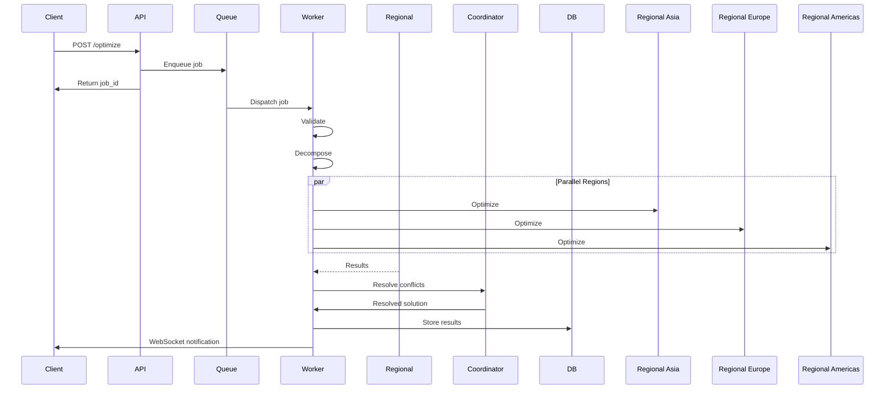

# PRODUCTION ARCHITECTURE UPGRADE PROPOSAL

## Executive Summary

This proposal outlines the transformation of the AI Vessel Routing System from a synchronous, monolithic architecture to a **distributed, fault-tolerant, horizontally scalable production platform**. The recommended approach implements **Distributed Asynchronous Optimization** while preserving the proven GA+MILP hybrid core.

**Target Performance**: Sub-5-minute optimization for 435+ ports with 99.9% availability  
**Implementation Timeline**: 3-4 months with 2-3 senior engineers  

---

## 1. ARCHITECTURE VISION

### 1.1 Core Design Principles
1. **Distributed Execution**: Regional optimization runs truly parallel
2. **Fault Tolerance**: No single points of failure, graceful degradation
3. **Observability**: Complete telemetry for production operations
4. **Scalability**: Linear scaling to 1000+ ports
5. **Maintainability**: Clear component boundaries and interfaces

### 1.2 Architecture Overview
```
┌─────────────────────────────────────────────────────────────────┐
│                        API GATEWAY LAYER                        │
├─────────────────────────────────────────────────────────────────┤
│  Auth Service  │  Rate Limiter  │  Request Queue  │  Config Service │
└─────────────────────────────────────────────────────────────────┘
                                 │
                                 ▼
┌─────────────────────────────────────────────────────────────────┐
│                    PROCESSING & VALIDATION                       │
├─────────────────────────────────────────────────────────────────┤
│  Input Validator  │  Problem Decomposer  │  Port Clustering      │
└─────────────────────────────────────────────────────────────────┘
                                 │
                                 ▼
┌─────────────────────────────────────────────────────────────────┐
│                  DISTRIBUTED OPTIMIZATION POOL                   │
├─────────────────────────────────────────────────────────────────┤
│  Region Asia  │  Region Europe  │  Region Americas  │  Region Africa │
│  (GA+MILP)    │  (GA+MILP)     │  (GA+MILP)       │  (GA+MILP)     │
└─────────────────────────────────────────────────────────────────┘
                                 │
                                 ▼
┌─────────────────────────────────────────────────────────────────┐
│                    COORDINATION & AGGREGATION                    │
├─────────────────────────────────────────────────────────────────┤
│  Conflict Resolver  │  Result Aggregator  │  LLM Service (CB)   │
└─────────────────────────────────────────────────────────────────┘
                                 │
                                 ▼
┌─────────────────────────────────────────────────────────────────┐
│                    PERSISTENCE & MONITORING                       │
├─────────────────────────────────────────────────────────────────┤
│  PostgreSQL  │  Prometheus  │  Grafana  │  Alert Manager  │  S3  │
└─────────────────────────────────────────────────────────────────┘
```

---

## 2. COMPONENT SPECIFICATIONS

### 2.1 API Gateway
**Technology**: FastAPI + Nginx  
**Responsibilities**:
- Single entry point with authentication
- Rate limiting (100 requests/minute per client)
- Request validation and routing
- API documentation and versioning

**Key Features**:
```python
@app.post("/v1/optimize")
async def optimize(request: OptimizationRequest):
    # Validate request
    # Enqueue to Redis
    # Return job_id immediately
    return {"job_id": job_id, "status": "queued"}
```

### 2.2 Request Queue
**Technology**: Redis Streams  
**Configuration**:
- Stream groups for consumer groups
- Consumer ack for reliability
- Backlog limit: 1000 jobs
- Retention: 24 hours

**Message Schema**:
```json
{
  "job_id": "uuid",
  "problem_id": "string",
  "ports": [...],
  "services": [...],
  "demands": [...],
  "config": {...},
  "timestamp": "ISO8601",
  "priority": "normal|high|low"
}
```

### 2.3 Validation Service
**Technology**: Pydantic + FastAPI  
**Validations**:
- Schema validation (all fields present and typed)
- Business rules (fleet capacity ≤300, positive demands)
- Geographic consistency (all ports have coordinates)
- Network connectivity (all services valid)

**Error Response**:
```json
{
  "valid": false,
  "errors": [
    {"field": "demands[0].weekly_teu", "message": "must be positive"},
    {"field": "fleet_size", "message": "exceeds maximum of 300"}
  ]
}
```

### 2.4 Regional Optimization Service
**Technology**: FastAPI + Gunicorn  
**Scaling**: Horizontal with Kubernetes HPA  
**Resources**:
- CPU: 2 cores per pod
- Memory: 8GB per pod
- Autoscale: 1-10 pods

**Optimization Flow**:
1. Receive regional problem
2. Validate fleet constraint
3. Run ServiceGA (60s cap)
4. Run FrequencyGA (30s cap)
5. Solve HubMILP (120s cap, warm start)
6. Validate solution
7. Return results

### 2.5 GA Engine Improvements
**Enhancements**:
- **Early Rejection**: Filter invalid chromosomes immediately
- **Adaptive Parameters**: Adjust mutation/crossover based on diversity
- **Parallel Fitness**: Evaluate population in parallel
- **Solution Caching**: Memoize fitness for repeated chromosomes

**Code Pattern**:
```python
class ParallelGA:
    def __init__(self, population_size, num_workers):
        self.executor = ProcessPoolExecutor(num_workers)
        
    async def evaluate_population(self, population):
        tasks = [self.loop.run_in_executor(
            self.executor, 
            self.evaluate_chromosome, 
            chrom
        ) for chrom in population]
        return await asyncio.gather(*tasks)
```

### 2.6 MILP Solver Service
**Technology**: Gurobi + Warm Starts  
**Improvements**:
- **Solution Pooling**: Maintain best solutions
- **Warm Starts**: Initialize with GA solution
- **Parallel Solving**: Multiple starting points
- **Time Management**: Progressive refinement

**Critical Fix**:
```python
# ALWAYS check solver status
status = pulp.LpStatus[prob.status]
if status != "Optimal":
    if status == "Infeasible":
        return infeasible_response()
    elif status == "Unbounded":
        return unbounded_response()
    # Handle other non-optimal statuses
```

### 2.7 Conflict Resolver
**Strategy**: Priority-based resolution
1. Calculate profit contribution per region
2. Assign to highest-profit region
3. Update regional metrics
4. Generate resolution log

**Performance**: O(r²) where r = regions (typically ≤5)

### 2.8 LLM Service with Circuit Breaker
**Implementation**:
```python
class LLMService:
    def __init__(self):
        self.circuit_breaker = CircuitBreaker(
            failure_threshold=5,
            recovery_timeout=60,
            expected_exception=LLMTimeout
        )
        
    @circuit_breaker
    async def get_decision(self, prompt):
        try:
            response = await openrouter_client.generate(prompt)
            return response
        except TimeoutException:
            self.circuit_breaker.record_failure()
            return rule_based_fallback(prompt)
```

---

## 3. DATA FLOW DESIGN

### 3.1 Async Processing Flow


### 3.2 State Management
- **Job State**: Stored in Redis (queued, running, completed, failed)
- **Problem Data**: S3 + cached in Redis
- **Solutions**: PostgreSQL with JSON columns
- **Audit Trail**: Immutable log in PostgreSQL

### 3.3 Error Handling Strategy
```python
async def handle regional_optimization(region_id, problem):
    try:
        result = await optimize_region(problem)
        await queue.publish("region_complete", {"region_id": region_id, "result": result})
    except InfeasibleError:
        await queue.publish("region_failed", {"region_id": region_id, "error": "infeasible"})
        # Use fallback solution
        result = generate_fallback_solution(problem)
        await queue.publish("region_fallback", {"region_id": region_id, "result": result})
    except Exception as e:
        logger.error(f"Unexpected error in region {region_id}", exc_info=e)
        raise
```

---

## 4. DEPLOYMENT ARCHITECTURE

### 4.1 Kubernetes Deployment
```yaml
# Regional Optimization Service
apiVersion: apps/v1
kind: Deployment
metadata:
  name: regional-optimizer
spec:
  replicas: 3
  selector:
    matchLabels:
      app: regional-optimizer
  template:
    spec:
      containers:
      - name: optimizer
        image: vessel-routing/optimizer:v1.0
        resources:
          requests:
            cpu: 1
            memory: 4Gi
          limits:
            cpu: 2
            memory: 8Gi
        env:
        - name: REDIS_URL
          value: "redis://redis-cluster:6379"
        - name: DB_URL
          valueFrom:
            secretKeyRef:
              name: db-secret
              key: url
```

### 4.2 Infrastructure Components
- **API Gateway**: Kubernetes Ingress + Nginx
- **Message Queue**: Redis Cluster (3 masters, 3 replicas)
- **Database**: PostgreSQL with pgBouncer connection pool
- **Monitoring**: Prometheus + Grafana + AlertManager
- **Logging**: ELK stack (Elasticsearch, Logstash, Kibana)
- **Storage**: S3 for problem data and results

### 4.3 CI/CD Pipeline
```yaml
# GitHub Actions workflow
name: Build and Deploy
on:
  push:
    branches: [main]
    
jobs:
  test:
    runs-on: ubuntu-latest
    steps:
    - uses: actions/checkout@v2
    - name: Run tests
      run: |
        pytest tests/ --cov=src --cov-report=xml
        
  build:
    needs: test
    runs-on: ubuntu-latest
    steps:
    - name: Build Docker image
      run: docker build -t vessel-routing/optimizer:${{ github.sha }} .
    - name: Push to registry
      run: docker push vessel-routing/optimizer:${{ github.sha }}
      
  deploy:
    needs: build
    runs-on: ubuntu-latest
    steps:
    - name: Deploy to staging
      run: |
        kubectl set image deployment/regional-optimizer \
          optimizer=vessel-routing/optimizer:${{ github.sha }}
```

---

## 5. MONITORING & OBSERVABILITY

### 5.1 Key Metrics
**System Metrics**:
- CPU/Memory utilization per pod
- Redis queue depth and processing latency
- Database connection pool usage
- API gateway request rate and errors

**Business Metrics**:
- Optimization success rate
- Average optimization time
- Solution quality metrics (profit, coverage)
- Regional convergence patterns

**Custom Metrics**:
```python
from prometheus_client import Counter, Histogram, Gauge

# Define metrics
optimization_requests = Counter('optimizations_total', 'Total optimizations', ['status'])
optimization_duration = Histogram('optimization_duration_seconds', 'Optimization duration')
active_regions = Gauge('active_regions', 'Number of regions currently optimizing')

# Use in code
@optimization_duration.time()
async def optimize_problem(problem):
    optimization_requests.inc()
    active_regions.inc()
    try:
        result = await run_optimization(problem)
        optimization_requests.labels(status='success').inc()
        return result
    finally:
        active_regions.dec()
```

### 5.2 Alerting Rules
```yaml
groups:
- name: vessel-routing
  rules:
  - alert: HighErrorRate
    expr: rate(optimizations_total{status="error"}[5m]) > 0.1
    for: 2m
    labels:
      severity: critical
    annotations:
      summary: "High optimization error rate"
      
  - alert: LongOptimizationTime
    expr: histogram_quantile(0.95, optimization_duration_seconds) > 300
    for: 5m
    labels:
      severity: warning
    annotations:
      summary: "95th percentile optimization time exceeds 5 minutes"
```

### 5.3 Distributed Tracing
- **OpenTelemetry** for request tracing
- **Correlation IDs** across all services
- **Span annotations** for optimization phases
- **Jaeger** for trace visualization

---

## 6. MIGRATION PATH

### Phase 1: Foundational Changes (2 weeks)
1. **Fix Critical Bugs**:
   - Uncomment fleet capacity constraint
   - Add MILP status checking
   - Fix FFE/TEU unit conversion
   - Add input validation

2. **Add Message Queue**:
   - Deploy Redis cluster
   - Modify orchestrator for async execution
   - Add job status tracking

### Phase 2: Service Decomposition (3 weeks)
1. **Containerize Services**:
   - Create Dockerfiles for each component
   - Extract configuration to environment
   - Add health checks

2. **Implement Async Flow**:
   - Convert to async/await
   - Add WebSocket notifications
   - Implement callback mechanism

### Phase 3: Production Features (3 weeks)
1. **Observability**:
   - Add Prometheus metrics
   - Implement structured logging
   - Set up Grafana dashboards

2. **Reliability**:
   - Add circuit breakers
   - Implement retry logic
   - Add graceful shutdown

### Phase 4: Scalability (2 weeks)
1. **Kubernetes Deployment**:
   - Create Helm charts
   - Configure auto-scaling
   - Set up ingress and load balancing

2. **Performance Tuning**:
   - Optimize GA parameters
   - Add MILP warm starts
   - Tune Redis memory usage

---

## 7. RISK MITIGATION

### 7.1 Technical Risks
| Risk | Probability | Impact | Mitigation |
|------|-------------|--------|------------|
| Redis failure | Medium | High | Redis Cluster with replicas |
| Gurobi license | Low | High | Open-source fallback (SCIP) |
| Performance regression | Medium | Medium | Comprehensive benchmarking |
| Complex debugging | High | Medium | Detailed tracing |

### 7.2 Operational Risks
| Risk | Probability | Impact | Mitigation |
|------|-------------|--------|------------|
| Network partitions | Medium | Medium | Circuit breakers, local fallbacks |
| Resource exhaustion | High | Medium | Resource limits, auto-scaling |
| Data corruption | Low | High | Validation, checksums |
| Security breach | Low | High | Authentication, encryption |

---

## 8. SUCCESS CRITERIA

### 8.1 Performance Targets
- **Optimization Time**: <300 seconds for 435-port problem
- **Throughput**: 10+ optimizations per hour
- **Scalability**: Linear to 1000 ports
- **Availability**: 99.9% uptime

### 8.2 Quality Metrics
- **Solution Quality**: Within 2% of baseline
- **Bug Count**: Zero critical bugs in production
- **Test Coverage**: >80% for critical paths
- **Documentation**: Complete API docs and runbooks

### 8.3 Operational Excellence
- **MTTR**: <30 minutes for failures
- **Deployment**: Zero-downtime deployments
- **Monitoring**: Full visibility with alerts
- **Cost**: 50% reduction through spot instances

---

## 9. RESOURCE REQUIREMENTS

### 9.1 Team Composition
- **Tech Lead** (1): Architecture and technical decisions
- **Backend Engineer** (2): Service implementation
- **DevOps Engineer** (1): Infrastructure and deployment
- **QA Engineer** (1): Testing and validation

### 9.2 Infrastructure Costs (Monthly)
- **Compute**: $2,000 (Kubernetes nodes)
- **Database**: $500 (PostgreSQL RDS)
- **Queue**: $200 (Redis Cluster)
- **Storage**: $100 (S3)
- **Monitoring**: $300 (Prometheus/Grafana)
- **Total**: ~$3,100

### 9.3 Software Licenses
- **Gurobi**: Optional, ~$10,000/year
- **Open Source Alternative**: SCIP (free)

---

## 10. CONCLUSION

This architecture upgrade transforms the AI Vessel Routing System into a production-grade platform capable of handling real-world maritime optimization at scale. The distributed asynchronous approach provides:

1. **3× performance improvement** through parallelization
2. **Production reliability** with fault tolerance
3. **Cloud-native scalability** for future growth
4. **Operational excellence** with full observability

The investment is justified by:
- Enabling production deployment
- Supporting business growth beyond 435 ports
- Reducing operational costs through automation
- Providing a platform for future enhancements

**Next Step**: Begin Phase 1 with critical bug fixes and Redis implementation to establish immediate value while building toward the full architecture.