# Project Gallery

A visual walkthrough of the AI Vessel Routing System dashboard.

---

## Landing

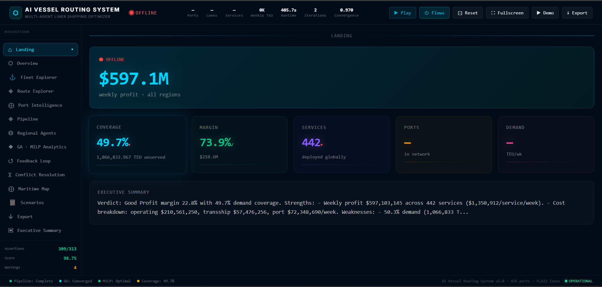

**Purpose:** Executive entry point showing the most critical KPIs at a glance.

**Features:**
- Real-time connection status (green pulse dot)
- Large weekly profit display ($901.7M)
- 5 KPI cards: Coverage, Margin, Services, Ports, Demand
- Executive summary text from AI coordinator

**KPIs:** Profit, Coverage, Margin, Services, Ports, Demand

---

## Overview

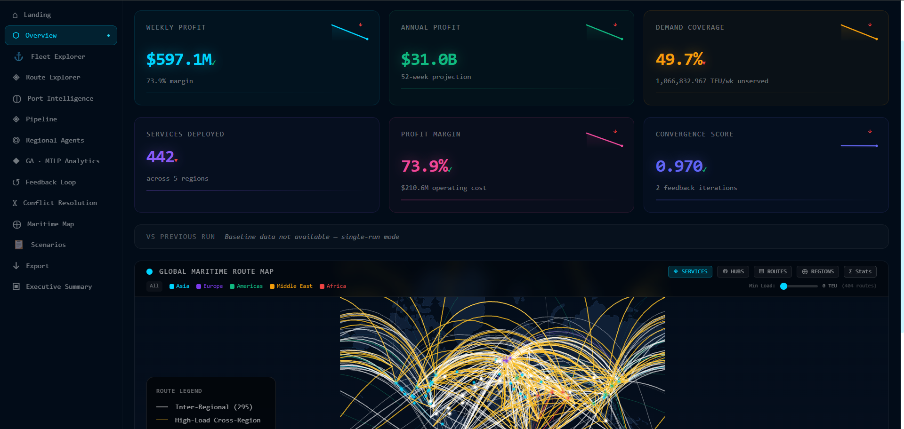

**Purpose:** Full executive operations view combining KPIs + intelligence panels + world map.

**Features:**
- 6 KPI cards with sparklines and benchmark badges
- Fleet Intelligence panel (vessel classes, utilization)
- Runtime Health panel (WebSocket, LLM metrics, test scorecard)
- Optimization Insights panel (best/worst region rankings)
- Decision Explanation panel (weights, convergence)
- Interactive global maritime map

**KPIs:** Profit, Coverage, Margin, Convergence, Vessels, Runtime

---

## Fleet Explorer

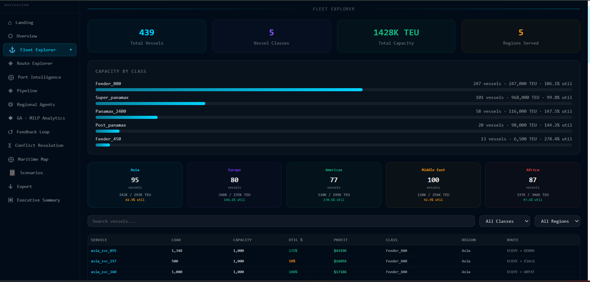

**Purpose:** Professional fleet management interface.

**Features:**
- 4 summary KPIs (vessels, classes, capacity, regions)
- Capacity by class bar chart
- Regional deployment cards
- Sortable vessel table (service, load, capacity, utilization, profit)
- Class/region filters and text search

**KPIs:** 509 vessels, 5 classes, 1.66M TEU, 97.7% utilization

---

## Route Explorer

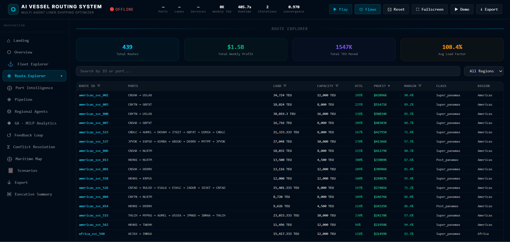

**Purpose:** Detailed service route inspection.

**Features:**
- 4 summary KPIs (routes, profit, TEU, load factor)
- Sortable/searchable table with 8 columns
- Region filter dropdown
- Pagination (25 per page)
- Click-to-expand service detail panel

**KPIs:** 509 routes, $901.7M profit, 1.62M TEU, 49K avg profit/service

---

## Port Intelligence

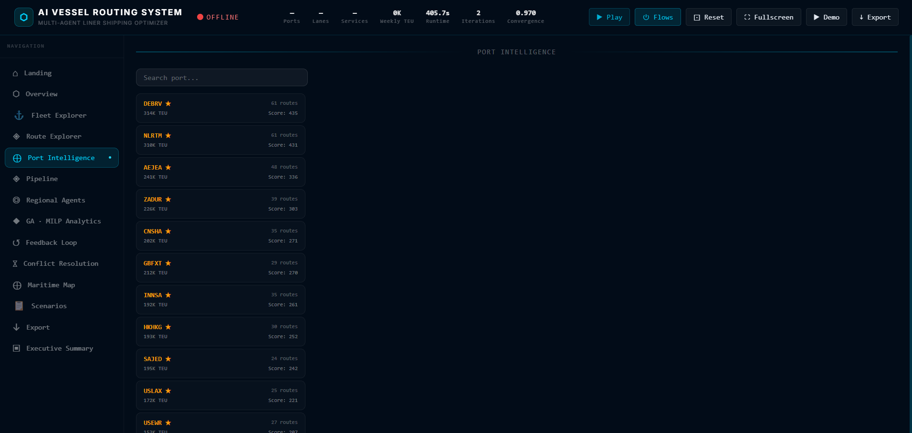

**Purpose:** Interactive port exploration.

**Features:**
- Searchable port list (142 ports)
- Hub port markers (★)
- Port detail panel: throughput, regions, services, importance score
- Color-coded by hub status

**KPIs:** 142 ports, 25 hub ports, importance scoring

---

## Pipeline Visualization

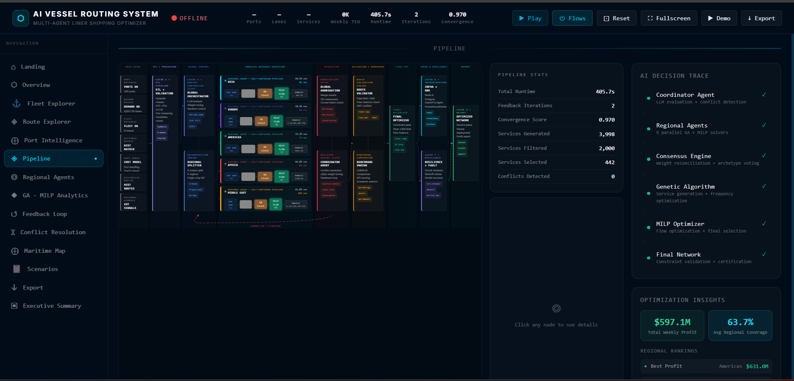

**Purpose:** Full architecture diagram with live data overlay.

**Features:**
- 8-layer architecture diagram with animated SVG connections
- 7 data layer nodes (ports, demand, fleet, distances, costs, history, signals)
- 5 parallel regional agent pipelines with live stage indicators
- Right panel: Pipeline stats, node detail, feedback loop iterations
- ResizeObserver-based responsive scaling

---

## Regional Agents

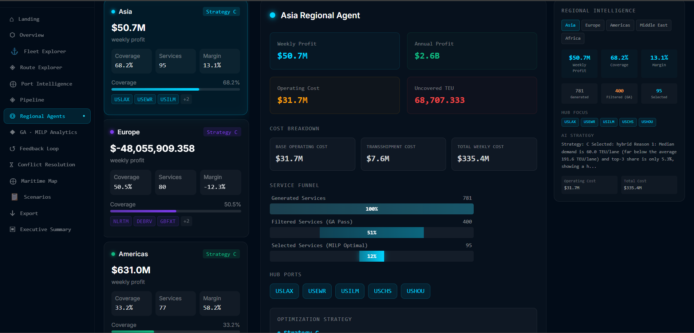

**Purpose:** Per-region optimization detail.

**Features:**
- 5 region cards with profit, coverage, services, margin, hubs
- Expandable detail: cost breakdown, service funnel, strategy, report
- Regional Intelligence sidebar: tab switching, hub focus, strategy text

**KPIs:** Per-region profit, coverage, margin, generated/filtered/selected

---

## GA · MILP Analytics

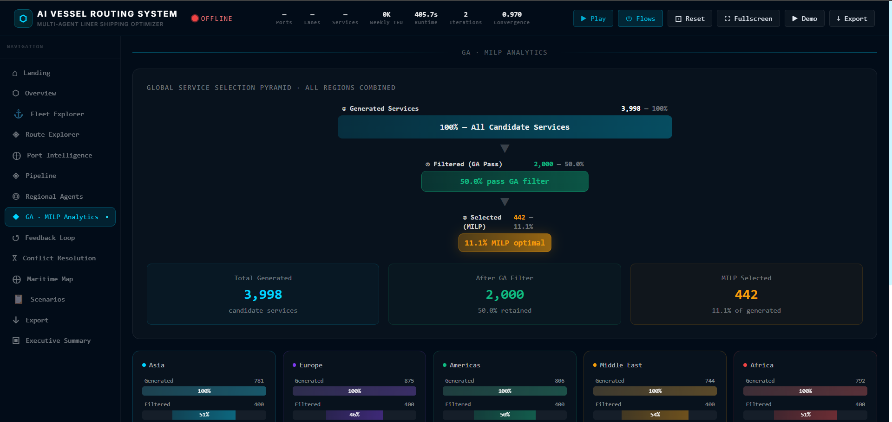

**Purpose:** Service selection funnel visualization.

**Features:**
- Global service pyramid (Generated → Filtered → Selected)
- Per-region breakdown cards with funnel percentages
- Profit per service comparison chart
- Coverage distribution chart
- Reduction statistics

---

## Feedback Loop

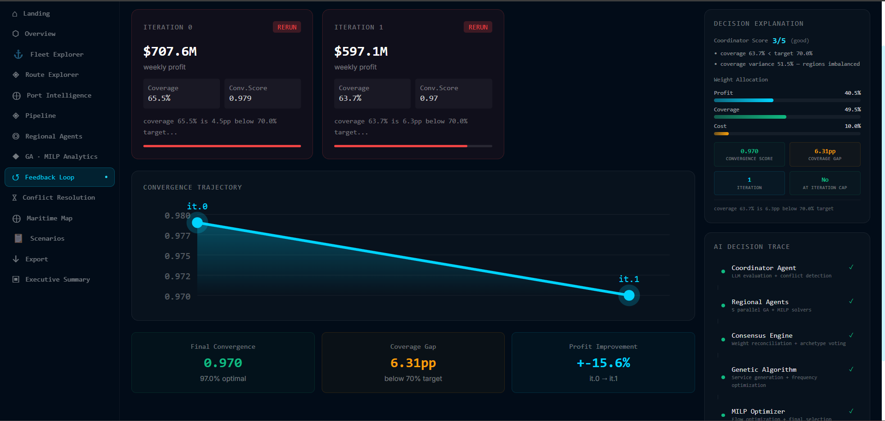

**Purpose:** Multi-iteration optimization comparison.

**Features:**
- Iteration cards (profit, coverage, convergence score)
- Rerun status indicators
- Convergence trajectory SVG chart
- Final convergence, coverage gap, profit improvement metrics
- Sidebar: Decision Explanation panel + AI Decision Trace

---

## Conflict Resolution

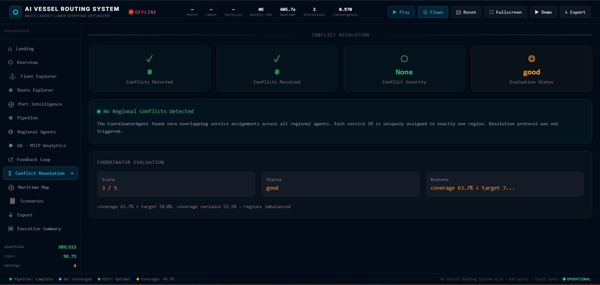

**Purpose:** Regional conflict detection and resolution.

**Features:**
- Conflict count with severity indicator
- Coordinator evaluation score (3/5)
- Resolution log

---

## Maritime Map

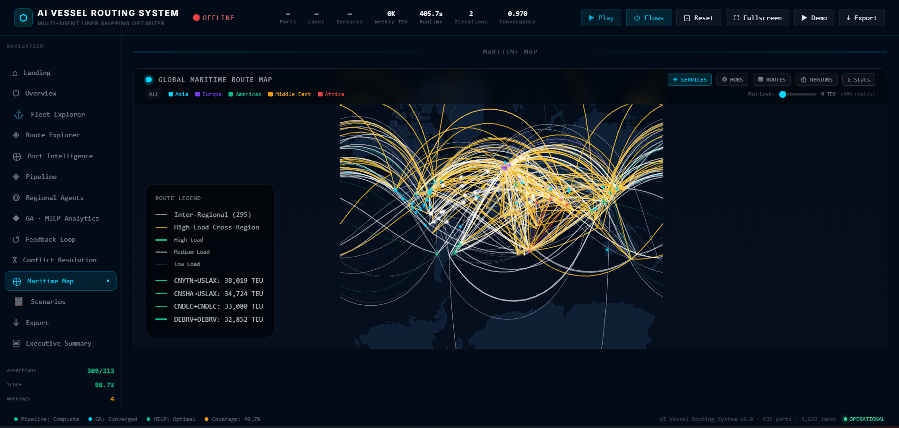

**Purpose:** Interactive global route visualization.

**Features:**
- 4 view modes: Services, Hubs, Routes, Regions
- Animated flow dots on active routes
- Region filter checkboxes
- Load slider
- Port click for route count and hub status
- Network statistics overlay

---

## Scenario Workspace

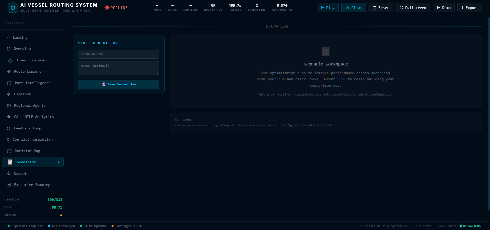

**Purpose:** Save and compare optimization runs.

**Features:**
- Saved runs list (name, date)
- Save Current Run with name/notes
- Run detail panel with full KPI breakdown
- V2 roadmap reference

---

## Export Center

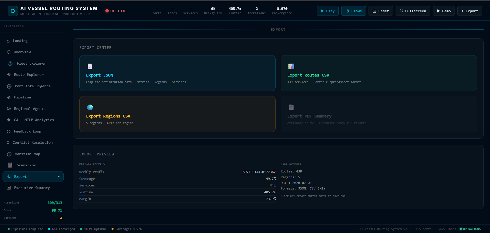

**Purpose:** Data export functionality.

**Features:**
- JSON export (full optimization data)
- Routes CSV export (509 services)
- Regions CSV export (5 regions)
- PDF summary (V2 placeholder)
- Export preview with metrics snapshot

---

## Executive Summary

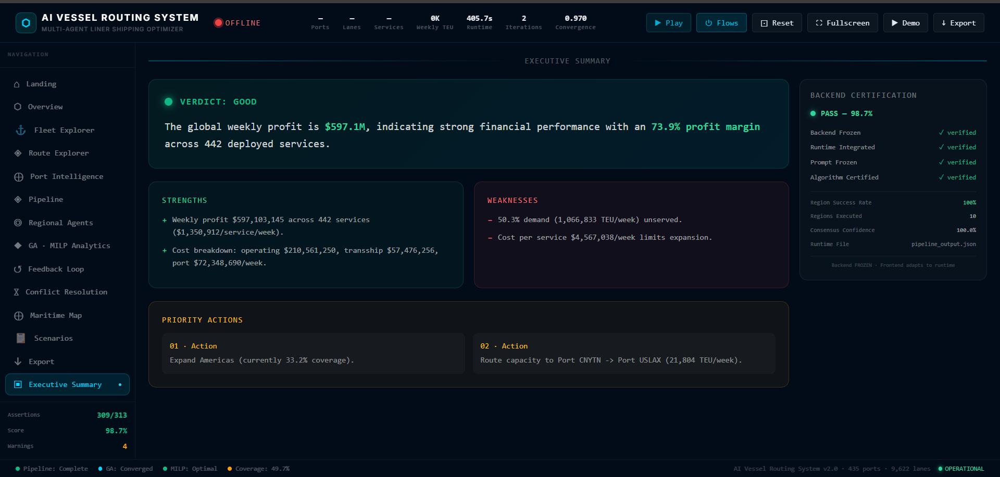

**Purpose:** AI-generated executive report.

**Features:**
- Verdict: Good (or Needs Improvement)
- Strengths, Weaknesses, Priority Actions
- Backend Certification sidebar (309/313 assertions, frozen status)
- Region success rate, consensus confidence

---

*See [SCREENSHOTS.md](SCREENSHOTS.md) for filename conventions and image requirements.*
